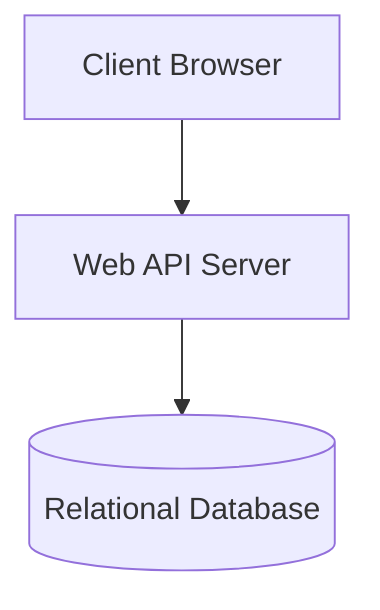

# Section 2: Architecture & Component Design

## Guidelines for AI Agent
* **Role:** Subagent A (System Architect)
* **Goal:** Document the overall system architecture model, component layout, and structural flow.
* **Target Files to Analyze:** Dockerfiles, docker-compose.yml, environment configurations, and high-level routing/bootstrap logic.
* **Mermaid Requirement:** Produce a high-level component diagram representing layers (e.g., UI Layer -> Service Layer -> Database).

## Output Template Structure
### 2.1 Architectural Paradigm
[Describe the system style, e.g. MVC, Microservices, Monolithic, or Event-driven, and justify why this architecture is used in this codebase.]

### 2.2 System Component Diagram
[Embed the cloud-rendered component diagram fetched from Kroki API using the Mermaid syntax below.]

### 2.3 Component Description & Interfaces
[List each component block shown in the diagram and define its primary role and communication protocol (e.g., HTTP REST, WebSocket, gRPC).]
* **Component 1:** [Description, protocols, and data inputs]
* **Component 2:** [Description, protocols, and data inputs]
