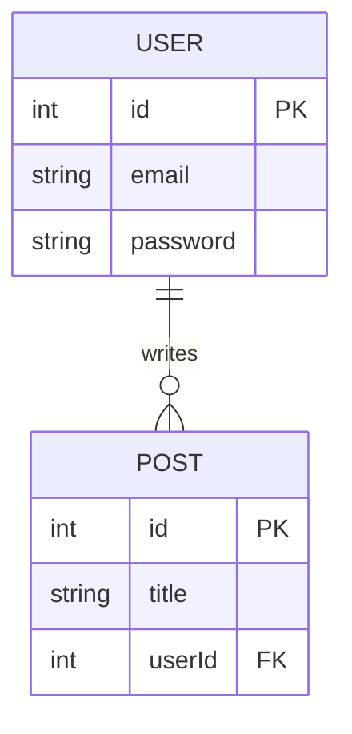

# Section 4: Database & Data Layer

## Guidelines for AI Agent
* **Role:** Subagent C (Data & API Specifier)
* **Goal:** Document the database structure, schema tables/collections, entity relationships, and indexes.
* **Target Files to Analyze:** Schema definition files (`schema.prisma`, `.sql` migrations, `models/` models definitions, mongoose structures).
* **Mermaid Requirement:** Generate a Mermaid.js Entity-Relationship (ER) diagram showing tables, keys, and entity cardinalities (1-to-many, etc.).

## Output Template Structure
### 4.1 Database Engine & Setup
[State the database engine used, e.g. PostgreSQL, MongoDB, Redis, and how connections/connection pools are managed in the code.]

### 4.2 Entity-Relationship Diagram
[Embed the cloud-rendered ER diagram fetched from Kroki API using the Mermaid syntax below.]

### 4.3 Database Schema Tables / Collections
[Create a detailed section or markdown table for each database table or document collection detailing its fields, data types, constraints, and relationships.]

#### Table: `users`
| Field Name | Data Type | Constraints | Description |
|---|---|---|---|
| `id` | INT | PK, Auto-Increment | Primary identifier |
| `email` | VARCHAR(255) | Unique, Not Null | Account registration email |
| `password` | VARCHAR(255) | Not Null | Hashed credentials hash |
