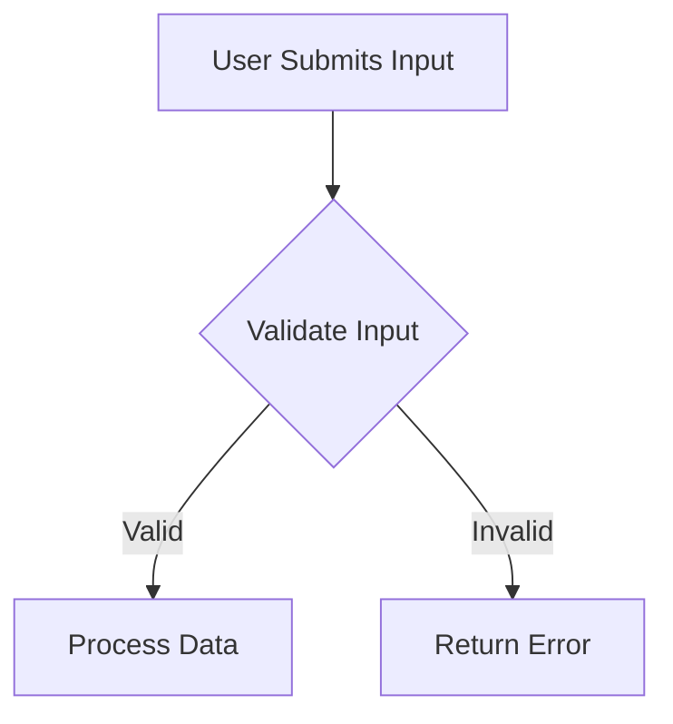

# Section 6: Operational Workflows & Logic

## Guidelines for AI Agent
* **Role:** Subagent B (Code & Logic Parser)
* **Goal:** Document the workflow execution logic for critical business paths and background tasks.
* **Target Files to Analyze:** Controller logic, event listeners, queues definitions, and background cron schedules.
* **Mermaid Requirement:** Create a flowchart showing the logical step-by-step resolution of a critical flow (e.g. user authentication or payment processing).

## Output Template Structure
### 6.1 Logical Flows & Workflows
[Identify and describe the main workflow operations in the codebase (e.g. user checkout flow, report generation, synchronization loops).]

### 6.2 Process Flow Diagram
[Embed the cloud-rendered flowchart diagram fetched from Kroki API using the Mermaid syntax below.]

### 6.3 Error Handling & Fallback Strategy
[Explain how errors, database connection drops, or API integration timeouts are caught and resolved in the code flow.]
